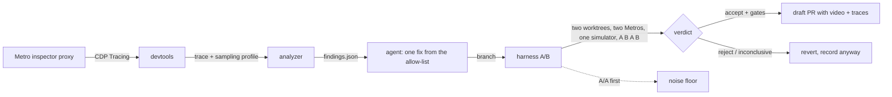

# Fixpoint

**Measure. Fix. Re-measure. Repeat until nothing changes.**

Fixpoint is an open-source, self-improving performance harness for React Native. It connects to a running dev build through React Native DevTools, records the render waterfall and JS flamegraph for every screen, turns them into deterministic findings, applies one fix from an allow-list, re-measures the fix against the original in an interleaved A/B on the same simulator, and opens a draft pull request only when the win survives the gates. No human in the middle until code review.

A fixpoint is the value where applying the function again changes nothing. Fixpoint iterates measure → fix → measure until the app reaches one.

<!-- demo gif: docs/demo/fixpoint-30s.gif, added after Phase 7 -->

## Why

Most AI coding agents stop at "you should memoize this". Fixpoint closes the loop. The model is not the story; the harness is: the wiring from a DevTools trace to a validated, reviewable PR with the proof video attached.

Three ideas carry it:

1. **Don't measure time. Measure work.** React 19.2 reports every component render, every props diff and every scheduler phase through its performance tracks. Render counts have no error bar.
2. **Run A/A before A/B.** The noise floor of base-against-base is the real acceptance threshold, never a hard-coded number.
3. **Zero edits to the app.** Everything attaches from outside: Metro's inspector proxy, the simulator, the filesystem. Navigation goes through Expo Router's own API over the debugger socket.

## Status

Version 0.1.0, not yet on npm. What has run for real against a production Expo app is in [docs/RESULTS.md](docs/RESULTS.md): `init`, `verify`, the startup capture, the React Compiler pass and a 25-route scan. The A/A, A/B, draft-PR and video steps are implemented and tested against fixtures but have not produced results yet; the results page says so rather than pretending.

## Install (from source)

Requirements: macOS with Xcode and a booted iOS Simulator, Node 22+, pnpm, an Expo app using the dev client (SDK 52+) with React Native 0.81+ and React 19.2+, and the app's own dependencies installed.

```bash
git clone https://github.com/iamxicor/fixpoint.git
cd fixpoint
pnpm install && pnpm build
alias fixpoint="node $PWD/packages/cli/dist/bin.js"   # or: pnpm link --global in packages/cli
```

## 60-second quickstart

With Metro running in your app (`npx expo start --dev-client`) and the app open on the simulator:

```bash
cd ~/your-app
fixpoint init            # detects scheme, bundle id, routes; writes fixpoint.config.mjs (import-free)
fixpoint verify          # connects, records two seconds, checks the React tracks
fixpoint scan            # cold-starts once for the startup capture, then records every route
fixpoint findings        # ranked table per route; --json for findings.json
```

`init` writes one file next to your package.json and nothing else. Everything Fixpoint produces goes to `~/.cache/fixpoint/<app>/`.

## Walkthrough: measuring a branch, then a fix

```bash
# 1. serve a clean ref from its own worktree (keeps your Metro untouched); leave it running
fixpoint serve --ref origin/main --port 8091

# 2. verify and scan against it
fixpoint verify --metro http://127.0.0.1:8091
fixpoint scan --metro http://127.0.0.1:8091
fixpoint findings /notifications

# 3. put one allow-listed fix on a branch (see docs/FIX-RECIPES.md), commit it, then calibrate and measure
fixpoint aa --route /notifications --base origin/main
fixpoint ab --route /notifications --base origin/main --candidate fixpoint/notifications-stable-row-props --video

# 4. gates and the PR text
fixpoint gates --dir <candidate checkout> --verdict ~/.cache/fixpoint/<app>/ab/<run>/verdict.json --out gates.json
fixpoint pr-body --verdict …/verdict.json --findings ~/.cache/fixpoint/<app>/scan/notifications/findings.json \
  --finding <id from findings.json> --recipe stable-row-props --gates gates.json --out body.md
gh pr create --draft --base main --title "$(…)" --body-file body.md
```

Routes that need parameters, auth or a flow (onboarding, pickers, camera) are listed by `fixpoint routes` with a reason; put them in `exclude` or give them `params` in the config.

With the Claude Code plugin (`claude --plugin-dir <fixpoint>/plugin`, run from your app's directory) the same loop is one command:

```
/fixpoint:optimize-screen /notifications
```

…which picks the top finding, applies one allow-listed fix on a branch, runs the gates and an interleaved A/B, and opens a draft PR or reverts.

## How it works



Packages: `@fixpoint/devtools` (protocol), `@fixpoint/analyzer` (pure findings), `@fixpoint/harness` (the method), `fixpoint` (CLI), `@fixpoint/mcp` (MCP server for any agent), `plugin/` (Claude Code skills). See [docs/ARCHITECTURE.md](docs/ARCHITECTURE.md).

## Measurement method

The long version is [docs/MEASUREMENT.md](docs/MEASUREMENT.md). The short version:

- **Work, not time.** Deterministic counts (`componentRenders`, `avoidableRenders`, `commits`, `maxComponentsPerCommit`) are primary and compared exactly. `renderMs` is secondary and reported with a 95 % bootstrap CI and a Wilcoxon p-value.
- **Visit discipline.** Screens are measured on the second visit so lazy module initialisation lands in neither variant. Startup is always a cold launch.
- **Interleaved A/B.** Two git worktrees, two Metro servers, one simulator, A B A B A B through the dev-client deep link. First pair discarded. Six pairs by default.
- **A/A calibration** before any A/B; its spread is the noise floor. An A/A "win" fails the harness, not the app.
- **Control frames.** Self time of functions in files the diff did not touch must stay flat; otherwise the pair is environment drift and is discarded.
- **Replay proxy.** Record-and-replay in front of the API; replay never forwards; mutations never reach a server.
- **Two passes.** Full instrumentation to diagnose, light counters to verify.
- **Gates.** typecheck, lint, existing tests, pixel diff ≤ 0.5 %, verdict `accept`. Always a draft PR. Never auto-merge.

## What it cannot see

The native main thread (layout, image decode, text measurement, shadow-tree commits), release-build behaviour, frame timing on React Native 0.85 (no frame events in CDP; `frame-drop` falls back to JS busy runs and says so), Android, bare React Native, physical devices. Every number Fixpoint prints is from a dev build on the iOS Simulator and is labelled so.

## Findings

`findings.json` ([schema](docs/FINDINGS-SCHEMA.md)) has eight kinds: `render-fanout`, `wasted-render`, `hot-component`, `long-task`, `frame-drop`, `startup-critical-path`, `heap-growth`, `compiler-bailout`. Each carries a primary metric with a `deterministic` flag and a `method`, evidence (symbolicated frames, components, commits), a source location, suggested fix ids and a plain-English summary. The agent never reads a raw trace.

## Fixes

The allow-list ([docs/FIX-RECIPES.md](docs/FIX-RECIPES.md)): remove a React Compiler bailout cause; stable row props and a memo boundary; move state down or split a context; lazy-require a startup module; FlashList/FlatList configuration; hoist inline literals; remove an effect that causes a redundant commit; add missing subscription cleanup. Business logic, data fetching and navigation structure are off limits.

## Configuration

`fixpoint.config.mjs` (written by `init`, import-free so it never touches your build):

| key | meaning | default |
|---|---|---|
| `scheme` | deep-link scheme (used only for the dev-client cold-start URL) | from app config |
| `bundleId` | iOS bundle identifier of the dev client | from app config |
| `simulator` | simulator name or udid | the booted one |
| `metroPort` / `metroUrl` | the running Metro `scan` attaches to | 8081 |
| `routes[]` | `{ path, params?, scenario? }` for dynamic routes and overrides | `[]` |
| `exclude[]` | route paths or prefixes to skip | `[]` |
| `apiBaseEnvVar` | `EXPO_PUBLIC_*` variable the replay proxy overrides | detected |
| `replay` | `{ mode: 'record' \| 'replay' \| 'off', dir, port }` | `off` |
| `thresholds` | `{ minEffect, alpha, maxControlDrift, analyzer }` | `0.05, 0.05, 0.25` |
| `interactions` | `cdp` (scroll/tap through DevTools), `idb`, `mcp`, `none` | `cdp` |
| `pairs` | measured A/B pairs | 6 |
| `abPorts` | Metro ports for base and candidate | `[8091, 8092]` |
| `outDir` | traces, screenshots, worktrees, verdicts | `~/.cache/fixpoint/<app>` |

## CLI

| command | what |
|---|---|
| `fixpoint init [dir]` | detect the app, write the config, print a summary |
| `fixpoint verify` | connect to the dev build, record two seconds, assert the React tracks |
| `fixpoint routes` | list discovered routes with skip reasons |
| `fixpoint scan [route]` | cold-start for the startup capture, record every route, analyse |
| `fixpoint findings [route]` | ranked tables from the latest scan |
| `fixpoint analyze <trace>` | offline: trace (+ cpuprofile, heap snapshots, startup capture, compiler bailouts) → table or JSON |
| `fixpoint aa --route --base` | A/A calibration, records the noise floor |
| `fixpoint ab --route --base --candidate [--video]` | interleaved A/B, verdict JSON |
| `fixpoint gates --dir --verdict` | typecheck, lint, tests, pixel diff, verdict |
| `fixpoint pr-body …` | PR title and body from verdict + findings + gates |
| `fixpoint baseline write\|check` | deterministic regression guard for CI |
| `fixpoint report` | RESULTS markdown from verdict files |
| `fixpoint serve --ref --port` | worktree + Metro for a git ref |

## Plugin skills

`/fixpoint:init`, `/fixpoint:scan [route]`, `/fixpoint:optimize-screen <route>`, `/fixpoint:optimize-app`, `/fixpoint:baseline`, `/fixpoint:report`. The MCP server (`fixpoint_verify`, `fixpoint_scan`, `fixpoint_findings`, `fixpoint_ab`, `fixpoint_aa`, `fixpoint_gates`, `fixpoint_pr_body`, `fixpoint_baseline`, `fixpoint_report`, `fixpoint_routes`) works with any MCP client.

## FAQ

**Does it change my app?** No. It writes `fixpoint.config.mjs` next to your package.json and everything else goes to `~/.cache/fixpoint/<app>`. Fixes are proposed as draft PRs.

**Does it send anything anywhere?** No telemetry of any kind. The only network calls are to your Metro, your simulator, and (in record mode) your own API through the local proxy.

**Why not just use the Performance panel?** You should. Fixpoint reads the same trace the panel shows, but turns it into counts that can be compared exactly between two builds, and automates the A/B.

**What about Android / release builds / bare RN?** Out of scope for v1. See [docs/DECISIONS.md](docs/DECISIONS.md) for what was verified and why.

**Which numbers in this README are real?** None are quoted here; the ones in [docs/RESULTS.md](docs/RESULTS.md) all come from files in `docs/results/`.

**Why did the first scan need three harness fixes?** Real apps throw during scenarios, have screens without scroll views, and fall into error boundaries. Each case is now detected and recovered from with a cold start; [docs/DECISIONS.md](docs/DECISIONS.md) has the details.

## Contributing

See [CONTRIBUTING.md](CONTRIBUTING.md). `pnpm install && pnpm build && pnpm test` runs everything against fixtures; no simulator needed.

## Licence

MIT. No telemetry.
